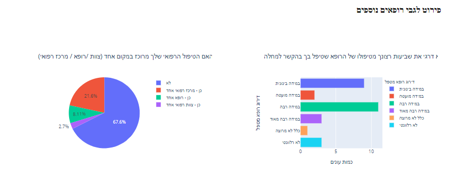
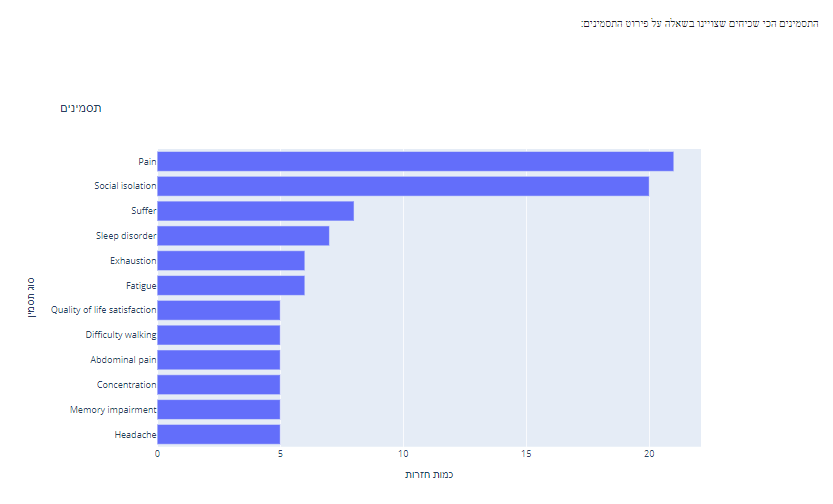
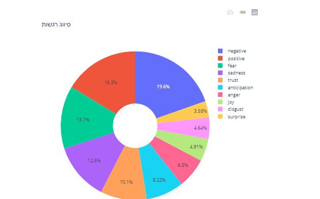

# Fibromyalgia Analysis

This is a university reserch projetct the specialyzing in the NLP field.
The project is written in Python and uses NLP (natural language processing) techniques for analyzing the data taken from a questionnaire about the Fibromyalgia disease

## The website of the project

[The analysis results for Fibromyalgia](https://sites.google.com/view/transparent-diseases-project/תוצאות-המחקר-עבור-מחלת-הפיברומיאלגיה)

## Screenshots

